# Flatcar Security Triage: Workflow and Architecture

This document explains how `security-triage` works end to end: the two
analysis pipelines (discovery and cleanup), the human-gated review/apply
workflow that is the only path allowed to mutate advisory issues, the model
routing layer, and the GitHub Actions orchestration around all of it.

It is generated from the actual `src/security_triage/` implementation and the
workflows in `.github/workflows/`, not from the aspirational process alone.

---

## 1. System at a Glance

The package implements a **read-only analysis + human-gated apply** pattern.
Nothing except `security-triage review apply` (invoked only after a
maintainer closes a review issue as *Completed*) can create, update, or
comment on an advisory issue.

```mermaid
flowchart LR
    classDef ext fill:#dbe9ff,stroke:#2b5797,color:#000
    classDef ro fill:#d9f2d9,stroke:#2e7d32,color:#000
    classDef gate fill:#fff2cc,stroke:#b38600,color:#000
    classDef mut fill:#f8d7da,stroke:#a71d2a,color:#000

    Upstream["Upstream security sources\n(Gentoo, oss-security, Go, RustSec, Red Hat)"]:::ext
    SBOM["Flatcar production SBOM\n(SPDX JSON)"]:::ext
    Issues["Flatcar/Flatcar\nadvisory issues"]:::ext

    Discovery["security-triage discovery\n(read-only)"]:::ro
    Cleanup["security-triage cleanup\n(read-only)"]:::ro

    ReviewCreate["security-triage review create\n(creates ONLY review issues)"]:::gate
    ReviewIssue["security-triage/review issue(s)\n(checkboxes + embedded manifest)"]:::gate
    Maintainer(["Maintainer reviews\nand closes as Completed"]):::gate

    ReviewApply["security-triage review apply\n(the only mutation path)"]:::mut

    Upstream --> Discovery
    Issues --> Discovery
    Issues --> Cleanup
    SBOM --> Cleanup

    Discovery --> ReviewCreate
    Cleanup --> ReviewCreate
    ReviewCreate --> ReviewIssue
    ReviewIssue --> Maintainer
    Maintainer -- "closed, reason=completed" --> ReviewApply
    ReviewApply -- "create / update / comment" --> Issues
```

Key invariant: **`discovery` and `cleanup` never accept a mutation flag.**
Only `review apply` has `--enable-*` flags, and it re-fetches the review
issue fresh from GitHub before trusting anything in it.

---

## 2. CLI Command Map

`security-triage` has three subcommands (`discovery`, `cleanup`, `review`),
and `review` has three of its own (`create`, `render`, `apply`). That
structure doesn't need a picture; what matters is what each one is and isn't
allowed to touch:

| Command | Mutates GitHub? | Purpose |
| --- | --- | --- |
| `discovery` | No | Scans upstream sources, matches against existing issues/SBOM, emits a discovery JSON/YAML document + Markdown report |
| `cleanup` | No | Scans open advisory issues against the current production SBOM, emits a cleanup JSON/YAML document + Markdown report |
| `review render` | No | Local dry-run: writes the exact review issue Markdown to files, no token/network needed |
| `review create` | Creates/updates **only** `security-triage/review` issues | Turns discovery/cleanup documents into one or more review issues, idempotently |
| `review apply` | Creates/updates/comments on **advisory** issues | Re-fetches a closed review issue and applies only checked, conflict-free, schema-valid actions |

---

## 3. Where the CVE Data Actually Comes From (Concretely)

This section exists because "fetch upstream sources" in a flowchart box hides the
actual mechanics. Here is exactly what gets called, what URL is hit, and what
comes back, source by source. All of this lives in `src/security_triage/sources.py`
plus its per-source helper modules.

**This tool never queries an official CVE database.** It never calls
`cve.org`, `nvd.nist.gov`, or any CVE-numbering authority API. Every CVE ID it
ever produces is a CVE ID that was already written down as plain text inside a
Gentoo bug, an oss-security mailing-list post, a Go vulndb entry, or a RustSec
advisory. The tool's job is to notice that text and act on it, not to originate it.

### 3.1 The four upstream sources, with exact endpoints

- **Gentoo Bugzilla** (`sources.fetch_gentoo_entries`). Calls the Bugzilla REST
  API directly:
  <https://bugs.gentoo.org/rest/bug?bug_status=__open__&component=Vulnerabilities&product=Gentoo%20Security&include_fields=...>.
  For every bug ID returned, it makes a second, batched call to
  `https://bugs.gentoo.org/rest/bug/<id>/comment` (100 IDs per batch) to pull the
  full comment thread. Bug `summary` + all comment bodies are concatenated into
  one text blob per bug; that blob, the bug's `creation_time`/`last_change_time`,
  and its `weburl` become one `SourceEntry`. No authentication is used; this is
  Gentoo's public Bugzilla REST endpoint.
- **oss-security mailing list** (`oss_security.fetch_oss_security_entries`,
  base <https://www.openwall.com/lists/oss-security/>). This has no JSON API:
  the code fetches the archive index HTML, regex-extracts message-number links
  (`_MSG_INDEX_RE`), fetches each message page, and regex-extracts the `<pre>`
  block containing the raw email body (`_PRE_RE`) plus thread-prev/next
  navigation links. The plain-text email body is the entry content. `oss_security.py`
  also imports `rules.extract_cves` directly and runs the CVE regex over each
  message as it's fetched, independent of whichever model is chosen later.
- **Go vulnerability database** (`go_vulndb.fetch_go_vulndb_entries`, base
  `https://vuln.go.dev`). This one **does** have a real JSON API; it fetches an
  index and then each advisory's JSON document, which already contains structured
  `aliases` (the upstream CVE IDs), affected module/version ranges, and a summary.
  Comparatively little text-mining is needed here because Go's database is
  already structured.
- **RustSec advisory database** (`rustsec.fetch_rustsec_entries`, via the GitHub
  API <https://api.github.com/repos/RustSec/advisory-db> and raw file fetches from
  <https://raw.githubusercontent.com/RustSec/advisory-db>. Each advisory is a
  Markdown file with a `` ```toml `` front-matter block (parsed with Python's
  `tomllib`) containing the CVE alias, package name, and patched-version range,
  followed by free-text Markdown description.
- **Red Hat Bugzilla** (optional, `--include-optional-sources`, off by default):
  <https://bugzilla.redhat.com/buglist.cgi?component=vulnerability&product=Security%20Response&resolution=--->.

All four fetchers return a list of `SourceEntry` objects (defined in
`records.py`): `source`, `source_url`, `entry_id`, `title`, `content`,
`published_at`, `updated_at`, `references`, plus source-specific `raw` data.
This is the common shape everything downstream operates on, regardless of
which upstream it came from.

### 3.2 How CVE IDs and package names get pulled out of that raw text

Two different mechanisms exist, and which one runs depends on `--model`:

1. **Regex extraction (always available, no network, no LLM).**
   `rules.extract_cves()` runs `_CVE_RE = re.compile(r"\bCVE-\d{4}-\d{4,}\b", re.IGNORECASE)`
   against the entry's text and returns every distinct match, upper-cased. This
   is the *only* mechanism used by `oss_security.py` while fetching (it tags
   entries with CVEs as it goes), and it is the entire mechanism used by
   `HeuristicModelClient.extract_advisory()` (selected via `--model heuristic`,
   and used as the fallback inside `FixtureModelClient` when a fixture has no
   canned answer for an entry). The heuristic client also has small dedicated
   regexes/heuristics for package name (`_extract_package_name`), fixed
   version (`_extract_fixed_versions`), affected version (`_extract_affected_versions`),
   and CVSS score (`_extract_cvss_context` + `rules.parse_cvss_scores`): all
   plain pattern matching over the same text, no model call at all.
2. **LLM extraction (`--model foundry` / `--model github`).**
   `DiscoveryWorkflow._process_entry()` calls `self.model_client.extract_advisory(entry)`
   exactly once per source entry. For `GitHubModelsClient`/`FoundryModelsClient`
   this sends a chat-completion request whose user payload is literally the
   entry's `raw` upstream data plus its normalized `title`/`content`/`comments`,
   and asks the model to fill in a fixed JSON schema: `package_name`, `cves`,
   `cvss_scores`, `affected_versions`, `fixed_versions`, `action_needed`,
   `summary`, `gentoo_ref`, `scope_assessment`, `confidence`. The system prompt
   (`EXTRACTION_SYSTEM_PROMPT`) instructs the model to treat all of that upstream
   text as untrusted data to read, never as instructions to follow. The model's
   JSON reply is parsed and passed through `rules.coerce_extraction()`, which
   clamps `confidence` to one of `high|medium|low` and drops any field the
   schema doesn't expect.

Either way, the result is the same shape: a `package_name`, a list of `cves`,
and a handful of other fields. Everything after this point (relevance decision,
SBOM matching, guardrails, issue creation) operates on that extracted record,
never on the raw upstream text again.

### 3.3 What happens right after extraction

`DiscoveryWorkflow._process_entry()` makes exactly one more model call per
entry, `decide_relevance(evidence_bundle)`, where `evidence_bundle` bundles the
extraction output together with SBOM package matches (from `sbom.SBOMIndex`,
matched by normalized package name/purl) and any existing GitHub issues whose
title/body already mentions that package. That call answers Flatcar-specific
questions the extraction step can't: is this a kernel CVE, a desktop package,
already tracked, SDK-only, sysext-only. Only after that does the deterministic
`rules.apply_discovery_guardrails()` step (plain Python, no model) get the final
say, as shown below.

---

## 4. Discovery Pipeline Flow (New Vulnerability Tracking)

The four upstream fetchers run independently and don't share a request
pattern (REST API vs. HTML scrape vs. JSON index vs. GitHub API); see
section 3.1 for the exact endpoints. What matters for the pipeline is that
they all normalize down to the same `SourceEntry` shape before anything else
happens.

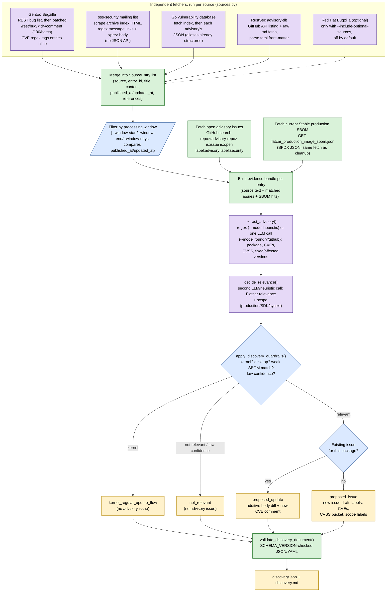

### 4.1 Relevance and Guardrail Decision Tree

`apply_discovery_guardrails()` in `rules.py` is the deterministic safety net
around the LLM's relevance call: it can only downgrade confidence or force a
`not_relevant`/`kernel_regular_update_flow` outcome, never upgrade one.

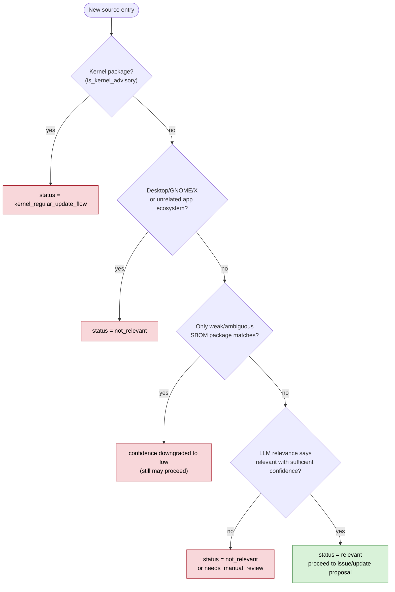

---

## 5. Where the SBOM Data Comes From and How Package Matching Works (Concretely)

Same treatment for the cleanup side: exactly one HTTP call, exactly one file
format, and a matching/comparison algorithm that is 100% plain Python (no LLM
involved unless the result is already ambiguous).

### 5.1 The SBOM fetch

`sbom.fetch_flatcar_production_sbom()` does a single `GET` against
<https://alpha.release.flatcar-linux.net/amd64-usr/current/flatcar_production_image_sbom.json>
(the `FLATCAR_PRODUCTION_SBOM_URL` constant), which is Flatcar's own published
SPDX-format JSON document for the current Stable production image. `SBOMIndex.from_spdx()`
walks its top-level `packages[]` array and, for each entry, keeps `name`,
`versionInfo`, `SPDXID`, `supplier`, `downloadLocation`, and any `externalRefs`
whose `referenceType == "purl"` (a package URL like `pkg:ebuild/openssl@3.1.4`).
That is the entire SBOM ingestion step; there is no caching layer, no diffing
against a previous SBOM, no database. Every `cleanup` run re-fetches this URL
fresh.

### 5.2 How an issue's package name gets matched against the SBOM

`SBOMIndex.match_package(package_name)` runs in two passes, both on
`rules.normalize_name()`-normalized strings (lower-cased, punctuation stripped):

1. **Exact pass.** Look for an SBOM package whose normalized `name` equals the
   normalized query, or whose purl's package name (`package_name_from_purl()`)
   equals it. If one or more exact matches exist, stop here and return them
   (tagged `exact_name` or `exact_purl`).
2. **Substring pass** (only runs if the exact pass found nothing). Look for SBOM
   package names that contain the query, or that the query contains, requiring
   at least 4 characters to avoid trivial false positives. If more than one
   distinct package matches this way, every result is tagged `ambiguous_substring`
   instead of a clean match, which later forces `needs_manual_review` (see the
   guardrail list in 6.1) rather than a confident remediation call.

### 5.3 How the fixed-version requirement is compared

`sbom.extract_fixed_version_requirements()` runs a regex
(`_REQUIREMENT_RE = r"(?:>=|at least|(?:update|upgrade) to >=?)\s*v?([0-9][0-9A-Za-z._+:-]*)"`)
against the issue's `Action Needed:` text to pull out one or more version
strings (handling `or`-separated alternative branches via `_OR_ALTERNATIVE_RE`/`_OR_BARE_VERSION_RE`).
`compare_simple_versions()` then parses both the SBOM's `versionInfo` and the
extracted requirement with `_COMPARABLE_VERSION_RE`
(`^v?(\d+(\.\d+){0,5})(-r(\d+))?$`, i.e. plain dotted numbers with an optional
Gentoo `-rN` revision suffix), pads them to equal length, and does a plain
tuple comparison. Anything that doesn't match that regex (an epoch, an `rc`
tag, a Gentoo slot, a non-numeric version) makes the comparison return
`ambiguous` rather than guessing, which is what ultimately produces
`needs_manual_review` in the diagram below.

None of this three-step process (fetch SBOM, match package, compare version) is
ever done by a model. The only place a model is consulted at all in the
cleanup pipeline is `review_cleanup()`, and only for cases the deterministic
logic already marked ambiguous or medium-confidence, purely as a second opinion
that (per `cleanup._finalize_cleanup_status()`) can confirm or downgrade the
preliminary status, never upgrade it to a more confident one.

---

## 6. Cleanup Pipeline Flow (Stale Advisory Verification)

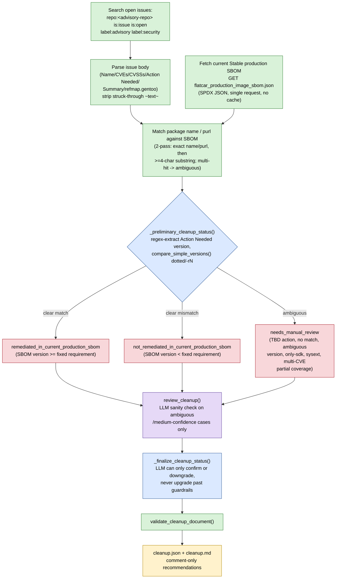

### 6.1 Version Comparison Guardrails

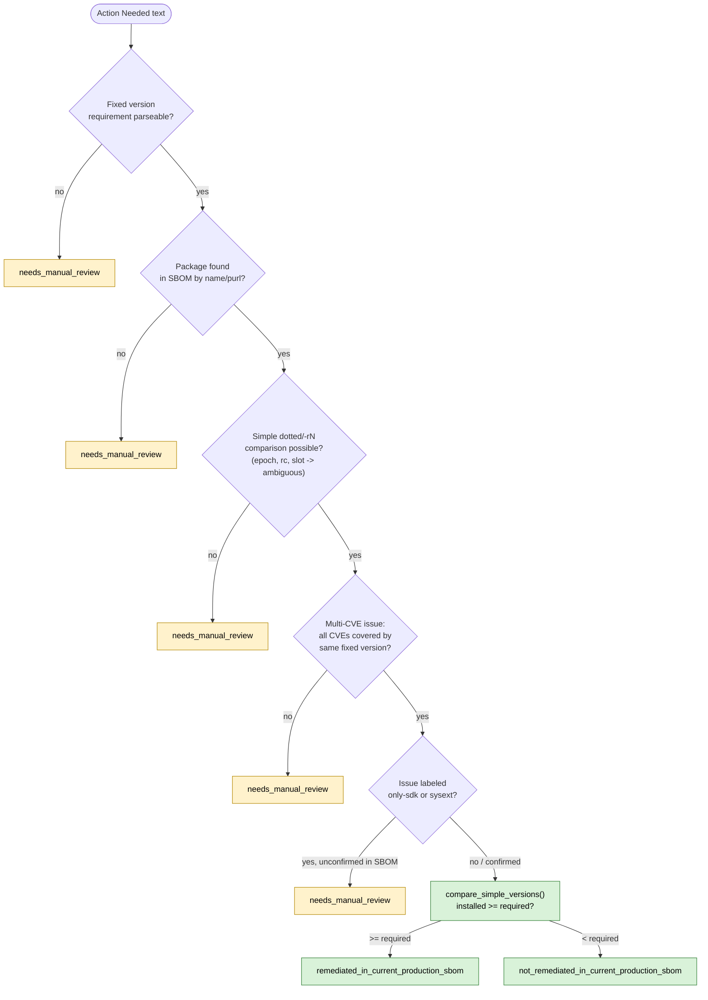

---

## 7. Human-Gated Review: Create -> Render -> Apply

This is the only mechanism that can turn discovery/cleanup output into actual
GitHub advisory issue mutations, and it is deliberately split into three
independent, individually testable stages.

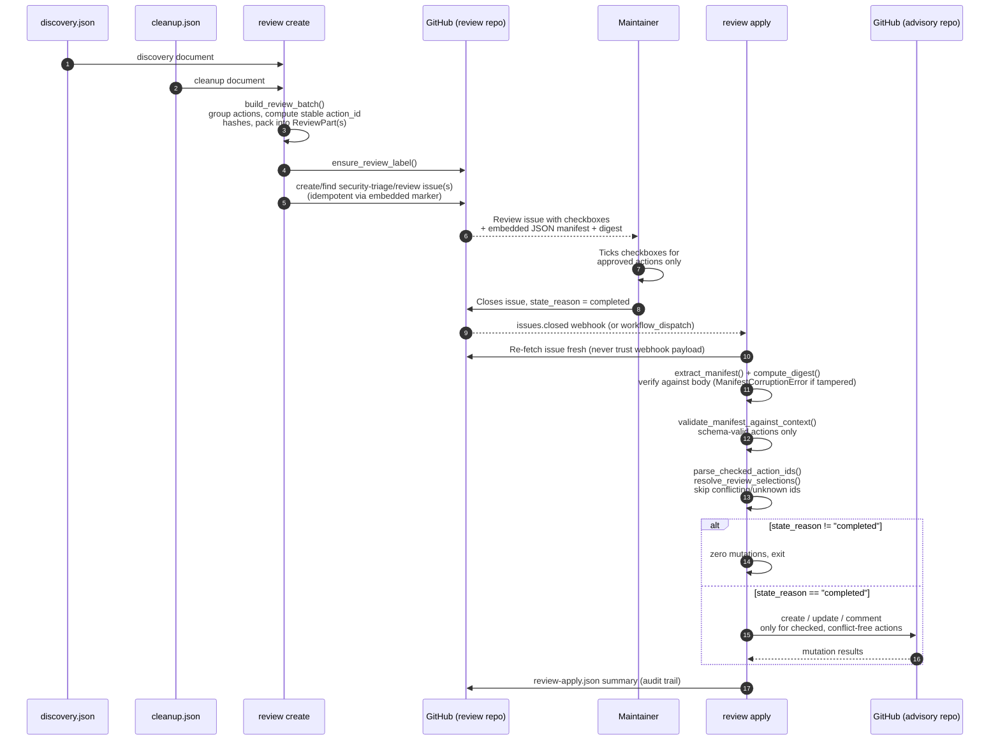

### 7.1 Review Issue Manifest Integrity

The review issue body embeds a canonical-JSON manifest plus a SHA-based
digest so that `review apply` can detect if the issue body was hand-edited
in a way that invalidates the recorded action set.

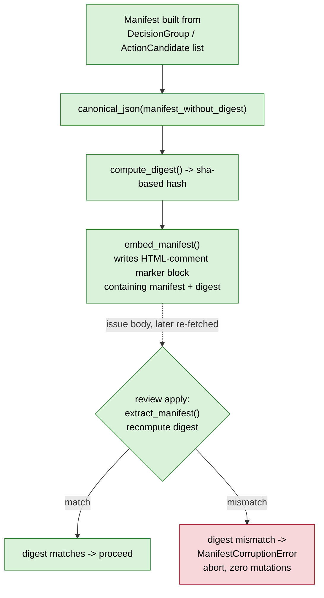

### 7.2 Review Issue Close-Reason Gate (State Machine)

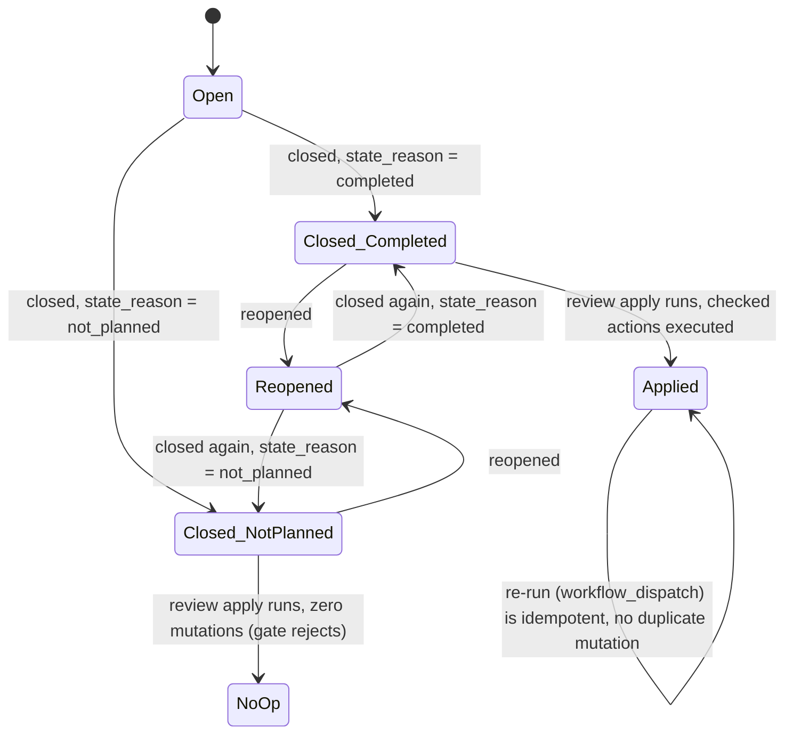

Only the `Closed_Completed` path leads to any GitHub mutation. Every other
close reason, including a stale re-open/re-close cycle, results in the
Python gate performing **zero** mutations, because `review apply` always
re-fetches the issue instead of trusting the webhook payload or any label.

---

## 8. Data Flow: Documents and Artifacts

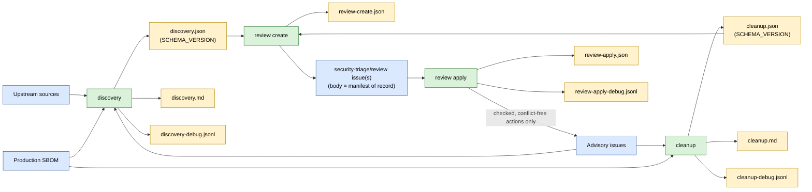

`discovery.json`/`cleanup.json` are the only inputs `review create` accepts;
it never re-runs analysis or talks to a model. `review apply` never reads
those JSON files again either: its only source of truth is the freshly
re-fetched review issue body plus the GitHub advisory issue state.

---

## 9. Model Provider Routing

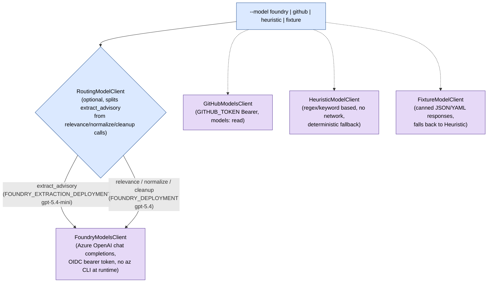

All model output is treated as **advisory pipeline input only**. Regardless
of provider, results pass through `coerce_extraction()`, `coerce_relevance()`,
`coerce_discovery_decision()`, and `coerce_cleanup_review()` in `rules.py`,
which clamp confidence, drop unexpected fields, and enforce that only the
deterministic guardrail logic can decide a final `status`.

---

## 10. Untrusted Data Handling

All upstream text (Bugzilla comments, mailing list posts, advisory pages,
issue bodies) is treated as data, never as instructions to a model.

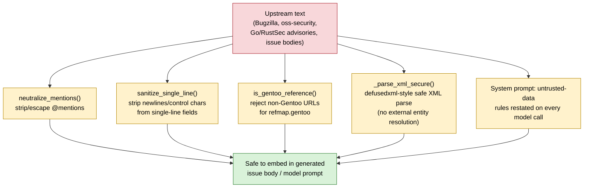

---

## 11. GitHub Actions Orchestration

Two workflows implement the daily analysis and the on-demand apply step.
Both are currently pinned to `flatcar/security-triage` for battle testing
(`SECURITY_TRIAGE_ADVISORY_REPO` / `SECURITY_TRIAGE_REVIEW_REPO` =
`${{ github.repository }}`), not yet `flatcar/Flatcar`.

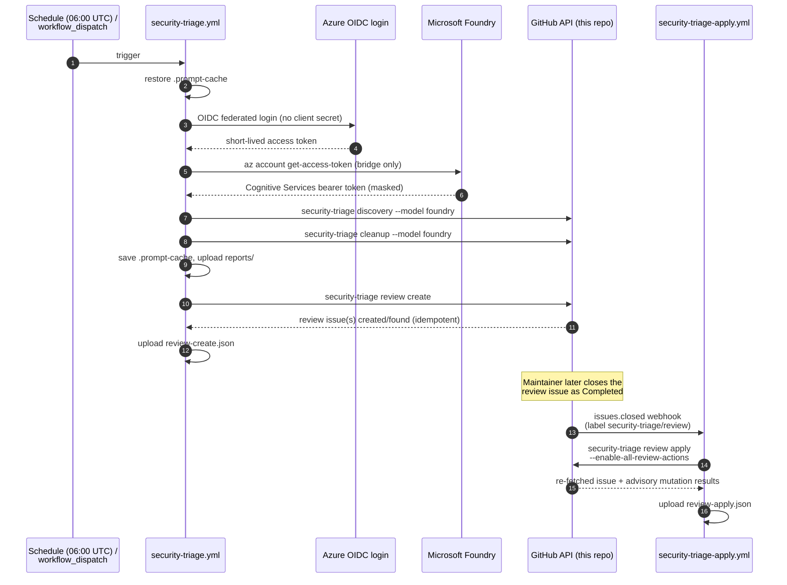

Concurrency groups matter here: `security-triage.yml` serializes daily runs
(`cancel-in-progress: false`) so a new schedule tick can never race an
in-progress review-issue creation sequence, and
`security-triage-apply.yml` scopes its concurrency group per issue number so
two close events (or a manual `workflow_dispatch` resume) for the same issue
can never race each other.

---

## 12. Permission Boundaries by Workflow Step

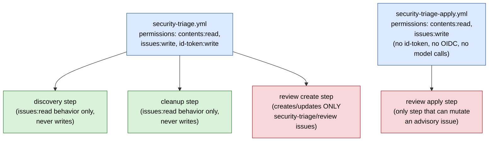

`security-triage-apply.yml` deliberately requests no `id-token` permission
and performs no OIDC exchange: applying an already-approved decision is a
fully deterministic, offline operation over GitHub API state, with no model
inference in the loop.

---

## 13. Advisory Issue Labeling Logic

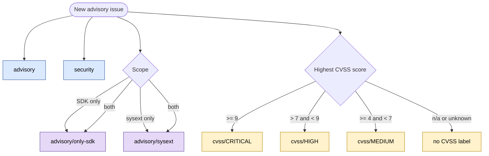

---

## 14. Repository Layout Reference

Every module below lives in `src/security_triage/`. `cli.py` is the only
entry point; `discovery.py` and `cleanup.py` are the two workflows that call
into the rest, and `review.py` is the only module that is ever allowed to
call a GitHub write endpoint against an advisory issue.

| Module | Called from | Responsibility |
| --- | --- | --- |
| `cli.py` | (entry point) | argparse wiring for `discovery`/`cleanup`/`review {create,render,apply}` |
| `discovery.py` (`DiscoveryWorkflow`) | `cli.py` | orchestrates: `sources.py` fetch -> `models.py` extract/relevance -> `rules.py` guardrails -> `reporting.py` |
| `cleanup.py` (`CleanupWorkflow`) | `cli.py` | orchestrates: `issues.py` fetch -> `sbom.py` match/compare -> `models.py` review -> `reporting.py` |
| `sources.py` | `discovery.py` | Gentoo/oss-security/Go/RustSec/Red Hat fetchers, `--window-*` filtering |
| `sbom.py` | `discovery.py`, `cleanup.py` | SPDX parsing (`SBOMIndex.from_spdx`), package matching, version comparison |
| `models.py` | `discovery.py`, `cleanup.py` | Foundry/GitHub/Heuristic/Fixture/Routing model clients (`*ModelsClient` classes) |
| `rules.py` | `discovery.py`, `cleanup.py`, `review.py` | schema validation, guardrails, label/CVSS logic, sanitization (used by all three workflows, never bypassed) |
| `issues.py` (`GitHubIssueClient`) | `discovery.py`, `cleanup.py`, `review.py` | issue search/fetch/parse; the only module that talks to the GitHub REST issues API |
| `review.py` | `cli.py` | `create`/`render`/`apply`; manifest build, digest compute/verify, the only module allowed to mutate an advisory issue |
| `actions.py` (`GitHubActionRunner`) | `review.py` | executes the checked, conflict-free create/update/comment calls `review apply` decided on |
| `issue_updates.py` | `review.py` | additive-only body diffs, `removal_guard_violations()` |
| `reasoning.py` | `discovery.py`, `cleanup.py` | builds the evidence bundle passed into each model call |
| `reporting.py` | `discovery.py`, `cleanup.py` | renders the human-readable `.md` report next to the `.json` document |

---

## 15. Summary of Guardrails That Cannot Be Bypassed

- **No mutation flags on `discovery`/`cleanup`.** Enforced in the `cli.py` argument parser. These two commands physically cannot mutate advisory issues.
- **Kernel CVEs never become advisory issues.** Enforced in `rules.is_kernel_advisory` and `apply_discovery_guardrails`. Routed instead to `kernel_regular_update_flow`.
- **LLM output can only downgrade confidence, never upgrade.** Enforced in `apply_discovery_guardrails` and `_finalize_cleanup_status`. Deterministic logic remains authoritative over the final `status`.
- **Additive-only issue body edits.** Enforced in `issue_updates.removal_guard_violations`. Existing CVEs, URLs, `Action Needed` text, and `Summary` text can't be silently deleted.
- **Manifest digest integrity.** Enforced in `review.compute_digest` and `extract_manifest`. A tampered review issue body aborts `apply` with `ManifestCorruptionError`.
- **Close-reason re-check on fresh fetch.** Enforced in `review.apply_review_issue`. Stale webhook payloads or labels can never trigger a mutation.
- **`--advisory-repo`/`--review-repo` validated.** Enforced in `rules.validate_repo_name`. Malformed repo strings are rejected before any API path or search query is built.
- **Untrusted upstream text is never treated as instructions.** Enforced in `rules.neutralize_mentions`, `sanitize_single_line`, `is_gentoo_reference`, and `sources._parse_xml_secure`. Prevents prompt injection and XML/URL abuse.

---

*Generated for the `flatcar/security-triage` repository. Diagrams reflect the
implementation in `src/security_triage/` and `.github/workflows/` as of the
current `main` branch; re-generate after significant changes to `discovery.py`,
`cleanup.py`, `review.py`, `rules.py`, or the workflow YAML files.*
